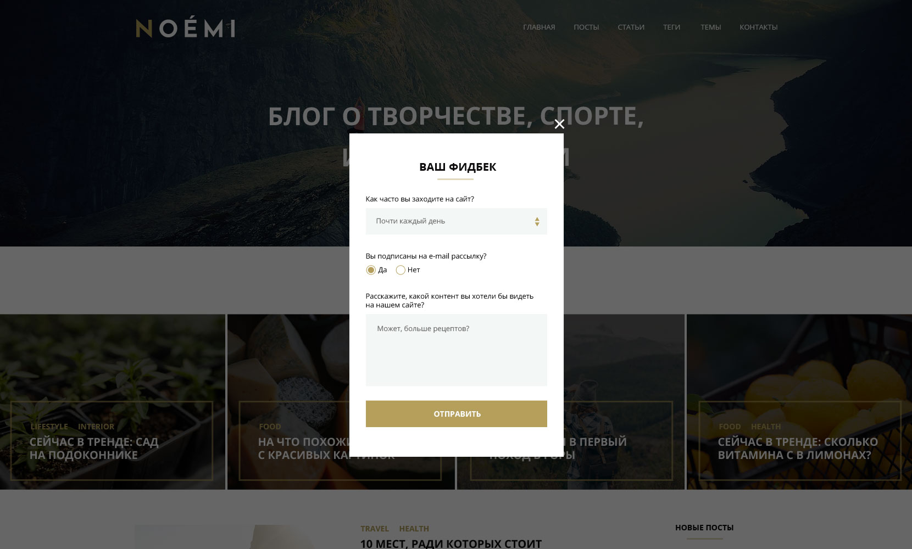

# Дипломный проект курса «Адаптивная и мобильная вёрстка»

## Требования по реализации диплома

Диплом должен быть реализован локально и опубликован на сервисе [GitHub](https://github.com/). 

В рамках дипломного проекта вам необходимо сверстать макет сайта для трёх групп устройств: десктопные экраны, планшеты и смартфоны.

Макеты сайта для различных экранов выглядят так:


## Содержание
1. [Основа проекта](#1-Основа-проекта)
2. [Кроссбраузерная вёрстка](#2-Кроссбраузерная-вёрстка)
3. [Семантическое использование тегов](#3-Семантическое-использование-тегов)
4. [Семантические названия атрибутов](#4-Семантические-названия-атрибутов)
5. [Валидная вёрстка](#5-Валидная-вёрстка)
6. [Реализация сетки](#6-Реализация-сетки)
7. [Добавление меньшего или большего количества контента в блоки](#7-Добавление-меньшего-или-большего-количества-контента-в-блоки)
8. [Ошибки загрузки изображений](#8-Ошибки-загрузки-изображений)
9. [Не используйте CSS-методологии](#9-Не-используйте-CSS-методологии)
10. [Не используйте готовые библиотеки](#10-Не-используйте-готовые-библиотеки)
11. [Не используйте CSS-препроцессоры или PostCSS](#11-Не-используйте-CSS-препроцессоры-или-PostCSS)
12. [Не используйте autoprefixer](#12-Не-используйте-autoprefixer)
13. [Оформление кода](#13-Оформление-кода)
14. [Файловая структура проекта](#14-Файловая-структура-проекта)
15. [Публикация проекта](#15-Публикация-проекта)

### 1. Основа проекта
Макет диплома для курса MQ основан на макете диплома для курса HTML. Вы можете взять код предыдущего диплома за основу и доработать его в соответствии с требованиями к диплому текущего курса. 

### 2. Кроссбраузерная вёрстка
В рамках проекта свёрстанные макеты должны корректно отображаться на следующих типах устройств:
- компьютерах с операционными системами Windows и macOS
- планшетах и смартфонах с операционной системой iOS
- планшетах и смартфонах с операционной системой Android

Кроме поддержки основных типов устройств требуется, чтобы вёрстка корректно работала в следующих браузерах:
- последняя версия Google Chrome
- последняя версия Mozilla Firefox
- последняя версия Edge
- последняя версия Opera
- последняя версия Safari
- последняя версия Mobile Safari
- последняя версия Mobile Chrome

Если у вас нет какого-то устройства или программы, постарайтесь их найти или используйте эмуляторы, встроенные в браузер. Тестирование на реальных устройствах — важный навык современного специалиста.

### 2.1 Соответствие вёрстки макету
Итоговый проект должен быть копией макетов, предоставленных дизайнером. При реализации допускаются небольшие отличия:
- толщина шрифта в браузерах и фотошопе
- межсимвольное расстояние
- различия в отступах до `5px`

### 2.2 Промежуточные состояния между макетами
Дизайнер подготовил 3 макета отображения страницы для устройств с шириной экрана `360px`, `768px` и `1200px`. Но дизайнер не предоставил отображения страницы в промежуточных состояниях, поэтому их нужно реализовать с помощью принципа «Резиновая вёрстка».

Таким образом, на экранах с шириной больше `1200px` фоновые блоки будут растягиваться на всю ширину экрана, а их контент будет центрироваться.

На устройствах с шириной экрана от `1200px` и более вам нужно реализовать дизайн макета `desktop.psd`.

Для устройств с шириной экрана, попадающей в диапазон от `641px` до `1200px`, вам нужно реализовать резиновый дизайн макета `tablet.psd`.

Для устройств с шириной экрана от `640px` и меньше вам нужно реализовать резиновый дизайн макета `mobile.psd`.

### 2.3 Состояния при повороте экрана
Вёрстка раздела «Сейчас в тренде» должна отличаться при портретной (вертикальной) ориентации экрана и при пейзажной (горизонтальной).

Для устройств с шириной экрана, попадающей в диапазон от `641px` до `1200px`, при портретной ориентации экрана карточки трендов должны быть выстроены в 2 колонки, а при пейзажной ориентации — в 4.

Для устройств с шириной экрана от `640px` и меньше при портретной ориентации экрана должна быть 1 колонка с карточками, а при пейзажной — 2.


### 2.4 Вёрстка всплывающей формы (pop-up)
Каждый макет содержит всплывающую форму на слое `Pop-up`, этот слой по умолчанию скрыт. Свёрстанная форма должна отображаться по центру экрана — поверх вуали, затемняющей страницу. 

**Вам не нужно реализовывать всплытие формы и её скрывание при клике на крестик.** Достаточно, чтобы форма была в разметке и ваш дипломный руководитель мог её найти. 

После того, как закончите с вёрсткой всплывающего окна, добавьте блоку класс `_hidden` и задайте этому классу свойства, скрывающие блок.



### 2.5 Вёрстка бургер-меню
**Вам не нужно реализовывать сворачивание и разворачивание бургер-меню при клике на иконку**. В зависимости от макета должна быть видима либо иконка, либо меню.

### 3. Семантическое использование тегов
В макетах проекта содержатся следующие элементы:
- разделы
- заголовки
- ссылки
- изображения
- подписи
- абзацы

Все эти элементы имеют специальные теги в стандарте HTML5, поэтому в рамках проекта вам необходимо их использовать.

К примеру, следующий код является грубой ошибкой:

```html
<div class="header">
  <div class="title">Заголовок сайта</div>
</div>
```

Кроме использования семантических тегов нужно правильно вкладывать теги по типу контекста. Запрещается в строчный элемент помещать блочный. Следующий код будет ошибочным:

```html
<span class="information">
  <h2 class="title">Заголовок блока</h2>
</span>
```

### 4. Семантические названия атрибутов
Кроме использования семантических тегов необходимо давать семантические названия на английском языке в качестве значений атрибутов. Не используйте транслит. 

Пример:

```html
<header class="shapka"></header>
```

Данный пример является грубой ошибкой. Название класса `shapka` следует заменить на `header`. Пример корректного названия:

```html
<header class="header"></header>
```

### 5. Валидная вёрстка
После полной реализации вёрстки протестируйте её с помощью сервиса [W3C Markup Validation Service](https://validator.w3.org). В итоговом отчете не должно быть ошибок или предупреждений.

### 6. Реализация сетки
Реализовать сетку страницы вам нужно при помощи `flexbox`. Использование библиотек, которые уже имеют готовые классы для сетки (Twitter Bootstrap, Zurb Foundation и другие), будет считаться ошибкой.

Также ошибкой будет считаться использование следующих способов вёрстки сетки:
- таблицы
- float-сетка
- сетка с помощью `inline-block`-элементов
- CSS Grids

### 7. Добавление меньшего или большего количества контента в блоки
Нужно протестировать блоки с информацией, добавив в них больше или меньше контента, чем представлено в макетах. Блоки не должны сломать соседние блоки, текст при этом должен быть полностью читаемым.

### 8. Ошибки загрузки изображений
При вёрстке изображений вам нужно предусмотреть ситуацию, когда по какой-либо причине они не загрузятся.

- В случае контентных изображений вёрстка не должна сломаться, а вместо изображения должен отображаться альтернативный текст, из которого станет понятно, что было изображено на картинке.

- Для декоративных изображений вам необходимо подобрать подложки для текста, чтобы текст был читаемым в любой ситуации. 

### 9. Не используйте CSS-методологии
В рамках курса мы не рассматриваем CSS-методологии — БЭМ, OOCSS, SMACSS и другие. Поэтому при работе над дипломом не используйте их.

### 10. Не используйте готовые библиотеки
В рамках дипломного проекта не следует использовать готовые библиотеки — normalize.css, reset.css, bootstrap и другие. Весь код вы должны написать самостоятельно.

### 11. Не используйте CSS-препроцессоры или PostCSS
В рамках курса мы не рассматриваем способы организации кода с использованием CSS-препроцессоров и PostCSS. Поэтому в дипломе вам не следует их использовать.

### 12. Не используйте autoprefixer
Для реализации кроссбраузерной вёрстки дипломного проекта вам не потребуется autoprefixer, поэтому его использование не приветствуется.

### 13. Оформление кода
Дипломный проект должен соответствовать принятому стилю кода для [HTML](https://github.com/netology-code/codestyle/tree/master/html) и [CSS](https://github.com/netology-code/codestyle/tree/master/css). В случае ошибок в оформлении проект не может быть принят и будет отправлен на доработку. 

### 14. Файловая структура проекта
Файловая структура проекта должна состоять из следующих элементов:
- `css` — папка, содержащая стили проекта
- `fonts` — папка, содержащая шрифты проекта
- `images` — папка, содержащая растровую графику проекта
- `svg` — папка, содержащая векторную графику проекта
- `index.html` — HTML-страница

Файлы проекта должны соответствовать [правилам именования файлов](https://github.com/netology-code/codestyle/tree/master/naming).  

### 15. Публикация проекта

При разработке проекта и для итоговой демонстрации вам нужно использовать сервис GitHub Pages. 
